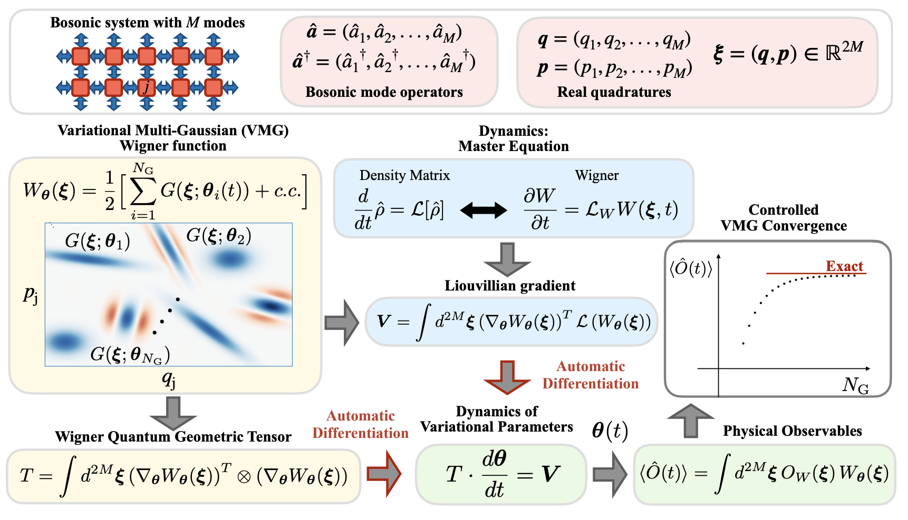

There has been significant experimental progress in circuit quantum electrodynamics, in part due to efforts towards a quantum computer. This has allowed us to probe and understand dissipative quantum chaos with larger and larger system sizes. There has been work looking at these systems in the semiclassical limit; however, we are interested in studying them in a fully quantum regime. A recent paper uses a sum of Gaussians to approximate the state and automatic differentiation to it in an efficient manner that avoids the exponential scaling of typically associated quantum many-body systems. We hope to apply this methodology to the Jaynes-Cummings-Hubbard model and see signs of chaos and thermalization in the fully quantum regime.

